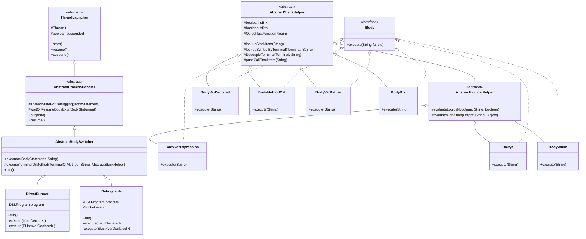
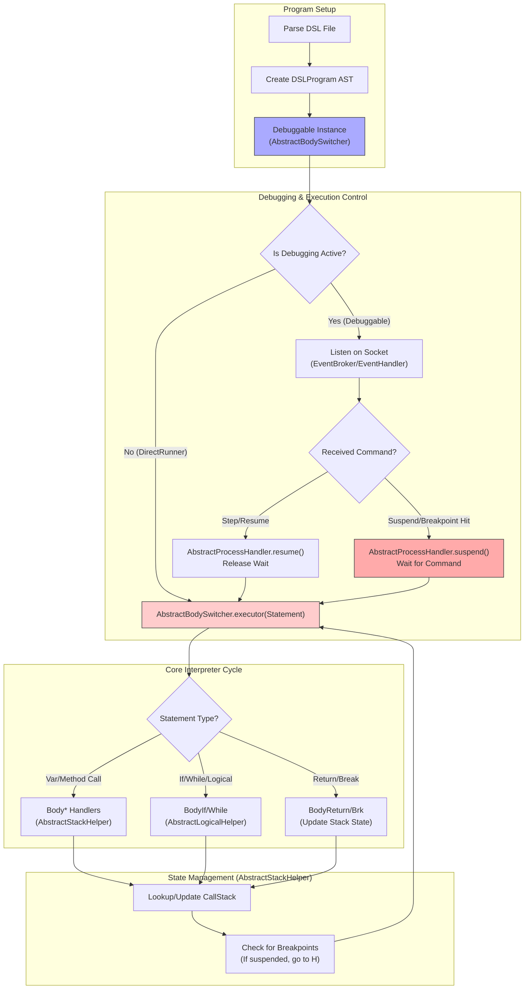

# smallD 🧸  
Language Engineering as a Toy Language — the name is *Small D*. Integrated with the Eclipse Debug UI 🐞, it provides a simple interpreter and debugger.

## Contents

- [Overview](#overview-)
- [What and Why is small D?](#what-and-why-is-small-d-)
- [Blueprint](#blueprint-️)
- [Features of the small D Project](#features-of-the-small-d-project-)
  - [1. small DSL language with Xtext](#1-small-dsl-language-with-xtext-️)
  - [2. Debuggable Interpreter & Debugger](#2-debuggable-interpreter--debugger-)
  - [3. Integration with Eclipse Debug UI](#3-integration-with-eclipse-debug-ui-️)
  - [4. Eclipse Product for Deploying](#4-eclipse-product-for-deploying-)
  - [5. Java & C# Generator](#5-java--c-generator-)
- [small D Specification](#small-d-specification-)
  - [Limitations](#limitations-️)
  - [Standard Functions](#standard-functions-for-testing-only-)
- [Class Hierarchy & Execution Flow](#class-hierarchy--execution-flow)
- [Setup & Deploy](#setup--deploy-️)
  - [Setup](#setup-️)
  - [Deploy Interpreter](#deploy-interpreter-)
  - [Equinox Configuration](#equinox-configuration-)
- [Troubleshooting](#troubleshooting-)
  - [Debug Ports](#debug-ports-)
  - [Known Issues](#known-issues-)
- [References](#references-)
- [License](#license-)

## Overview 🔍

1. `org.xtext.labs.mydsl.interpreter` is fully developed and designed based on parsing results. It's **not** a built-in feature of the Xtend framework.
2. The interpreter is integrated with the Eclipse Debug UI — this is an **independent** module, not relying on Xtend.
3. Code editor functionalities are provided and fixed by the Xtend framework.
4. Minimap view and deployment are implemented via Eclipse plugin development.
5. ANTLR parses the language definition file at `org.xtext.labs.mydsl/src/org/xtext/labs/Mydsl.xtext`. Once parsing is complete and the AST is generated, it becomes the foundation for all language customization and engineering.

## What and Why is small D? ❓

Small D is a *toy language* for exploring Language Engineering.  
“D” stands for **DSL** (Domain-Specific Language). Unlike general-purpose languages like C or Java, DSLs are tailored for specific tasks or domains.

Normally, implementing a new language doesn’t make sense for time- or budget-constrained projects. But sometimes, it's necessary. Unfortunately, simple and practical references are hard to find, and most DSLs are proprietary, making examples rare.

Even finding debugger documentation often leads to low-level gdb or obscure references — not practical for newcomers. That’s why I created a small language with essential IDE features for learning purposes. I hope it helps you, too. 🙌


- **What**: Lexer 🪓 → Parser 📜 → Interpreter 🧠 → Debuggable Interpreter 🐛 → Eclipse Debug UI 🎛️  
- **Intermediate Products**: Token (lexer) → AST (parser) → Call Stack & Symbol Table (interpreter)  
- **How**: Using Xtext Framework 🛠️ + Custom Implementations 💡

## Features of the small D Project 🌟

### 1. small DSL language with Xtext ✍️

🧱 Xtext documentation is sparse, sometimes outdated, and the community is small — but it's still better than nothing.

Features:
1. Error Checking
1. Semantic/Syntax Coloring
1. Outline View
1. Hover Tooltips
1. Auto-completion (Proposal)
1. Scoping, Cross-referencing, Labeling
1. Minimap View
1. Formatting, 🛠️ Quick Fix
1. Folding, 📌 Go-To Declaration

### 2. Debuggable Interpreter & Debugger 🐛

- Features a 🧮 call stack, 🧾 symbol table, and AST (Abstract syntax tree)
- Interpreter can **suspend ⏸️** and **resume ▶️** based on commands

### 3. Integration with Eclipse Debug UI 🎛️

- Communication with Eclipse Debug UI:
  - **Request Socket <=> Response (data)**
  - **Event Socket**


### 4. Eclipse Product for Deploying 🚀

- Use the Eclipse Product export wizard 🧙‍♂️
- Project: `org.xtext.labs.mydsl.product`
- File: `DSLDeveloper.product`

🛠️ For installers: Use [Inno Setup](https://www.jrsoftware.org/isinfo.php) — free and easy 💸

### 5. Java & C# Generator 🔄

- DSL code can be **converted to Java and C#** (though not perfectly, a feature of Xtend Framework)
- In C#, all function parameters are converted using `ref` (demonstrates call-by-reference) 🔁 — 💡 Pascal is a well-known language that supports call-by-reference.
- `org.xtext.labs.mydsl/src/org/xtext/labs/generator/MydslGenerator.xtend` → Java generator
- `org.xtext.labs.mydsl/src/org/xtext/labs/generator/MydslGeneratorCS.xtend` → C# generator

## small D Specification 📚

Sample code can be found in `org.xtext.labs.mydsl.product/src`


- `num`, `string`, `bool`
- Multi-dimensional arrays
- `if ~ else` (no `else if`)
- `while` loop only
- Function definition: `def function_name() {}`
- `launch_main` is the entry point
- Scope resolution: local → global fallback
- No object-oriented features

### Limitations ⚠️

- Not supporting Direct function calls in expressions

  ❌ `printstr(numtostr(b))`  
  ✅
  ```dsl
  a = numtostr(b)
  printstr(a)
  ```

### Standard Functions (for testing only) 🧪

| Function | Description |
|----------|-------------|
| `printstr(varStr)` | 🖨️ Print string |
| `strjoin(var1, var2)` | 🔗 Join two strings |
| `varArr = strsplit(var1, "delimiter")` | Split string into array |
| `varStr = numtostr(varNum)` | Convert number to string |
| `getargs(index)` | Get command line argument |

## Class Hierarchy & Execution Flow

The interpreter module (`org.xtext.labs.mydsl.interpreter`) is designed with a layered architecture for processing DSL statements and managing debugging state.





| Component | Description |
|-----------|-------------|
| `ThreadLauncher` | Base class for thread lifecycle management (start, suspend, resume) |
| `AbstractProcessHandler` | Handles debugging state transitions and breakpoint detection |
| `AbstractBodySwitcher` | Routes body statements to appropriate handlers based on type |
| `AbstractStackHelper` | Utilities for call stack and symbol table manipulation |
| `AbstractLogicalHelper` | Logical and comparison operation utilities |
| `DirectRunner` | Runs interpreter without debugging support |
| `Debuggable` | Runs interpreter with full debugging support |
| `EventBroker` | Socket server for Eclipse Debug UI communication |
| `EventHandler` | Processes debug commands (resume, step, suspend, breakpoints) |

## Setup & Deploy ⚙️

1. Import the project into Eclipse
2. Export `org.xtext.labs.mydsl.interpreter` as a **Runnable JAR**
3. Copy the JAR
4. Open `DSLDeveloper.product`
5. Use Eclipse Product Export Wizard (in Overview tab)
6. Create a new DSL file from MyDsl project
- Export `debugDSL.jar` from `org.xtext.labs.mydsl.interpreter`
- Copy to: `D:\DSLDeveloper\debug\debugDSL.jar` *(example path)*

<!-- ### Equinox Configuration 🧩

Reference: [Robert Wloch’s Blog](http://www.robertwloch.net)

```
1. In the Plug-ins tab change the Launch with select box to plug-ins select below only and uncheck the Target Platform subtree and check the two options below the plug-ins list. In the search field above the plug-ins list enter equinox. and check the equinox.ds plug-in: In the filtered list also check the equinox.util plug-in: Now enter appl in the search field and check the ui.ide.application plug-in:
2. Switch to the Configuration tab and check Clear the configuration area before launching. This ensures that runtime Eclipse doesn't cache plug-in configuration which avoids occational pitfalls.
3. The last change needs to be done in the Common tab. Switch the radio choice to Shared file and enter the Project Explorer path to the product plug-in: /de.rowlo.testgenerator.testdsl.product. This will tell Eclipse to save that run configuration in a launcher file in the specified location:
4. Finally switch back to the Plug-ins tab, clear the search filter and check the checkbox Validate plug-ins automatically prior to launching. Then click several times on Add Required Plug-ins right of the plug-ins list. You can stop clicking when the number of selected plug-ins does not change no more. To check if nothing's missing click on Validate Plug-ins. Eclipse should tell you that no problems were detected. Click on Apply and Close the dialog now.
```
-->

## Troubleshooting 🔧

### Debug Ports 📡

Ports used:

* `29777`, `29888`

If port error occurs:

```sh
cmd> netstat -ona | findstr 0.0:29777
TCP    0.0.0.0:29777      0.0.0.0:0      LISTENING       3116

cmd> taskkill /F /PID 3116
```

🛑 PID `3116` will be terminated

### Known Issues ⚠️

* Main function arguments set via *Launch Configuration*
* Use *DSL Editor* (not Xtext Editor) for debugging
* Dev environment: **Xtext 2.12.0**, **Java SE 1.8**, **Eclipse Neon.3**
* Minimap View: [https://github.com/apauzies/eclipse-minimap-view](https://github.com/apauzies/eclipse-minimap-view)

**Variables view empty after suspend:**

> Workaround: switch view or reload it.
> [Details](http://codeandme.blogspot.jp/2013/11/debugger-9-variables-support.html)

## References 🔗

| Topic | Resources |
|-------|-----------|
| **Xtext** | [eclipse.org/Xtext](https://eclipse.org/Xtext/) • [LorenzoBettini (GitHub)](https://github.com/LorenzoBettini) • [hishidama.home (JP)](http://www.ne.jp/asahi/hishidama/home/tech/eclipse/xtext/index.html) |
| **Language Engineering** | [Let's Build a Simple Interpreter](https://ruslanspivak.com/lsbasi-part1/) |
| **Eclipse Debugger** | [Eclipse Debugger How-to](https://eclipse.org/articles/Article-Debugger/how-to.html) • [Vogella Tutorial](http://www.vogella.com/tutorials/EclipseDebugFramework/article.html) • [Code and Me](http://codeandme.blogspot.com/) |
| **Deploying as Product** | [Robert Wloch's Tutorial](http://www.robertwloch.net/2016/08/the-few-hours-minutes-shiny-dsl-product-tutorial/) |

## License 📜

© 2017 kimtth

